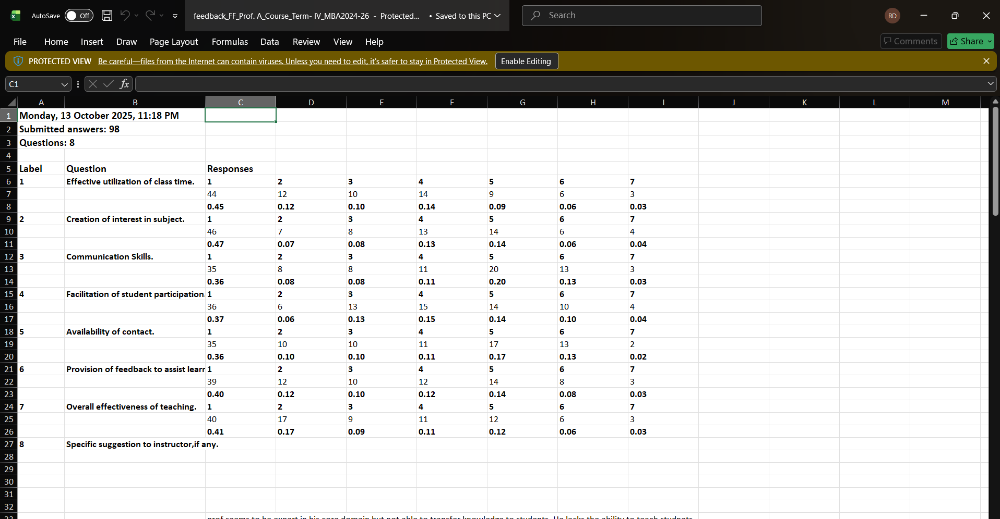
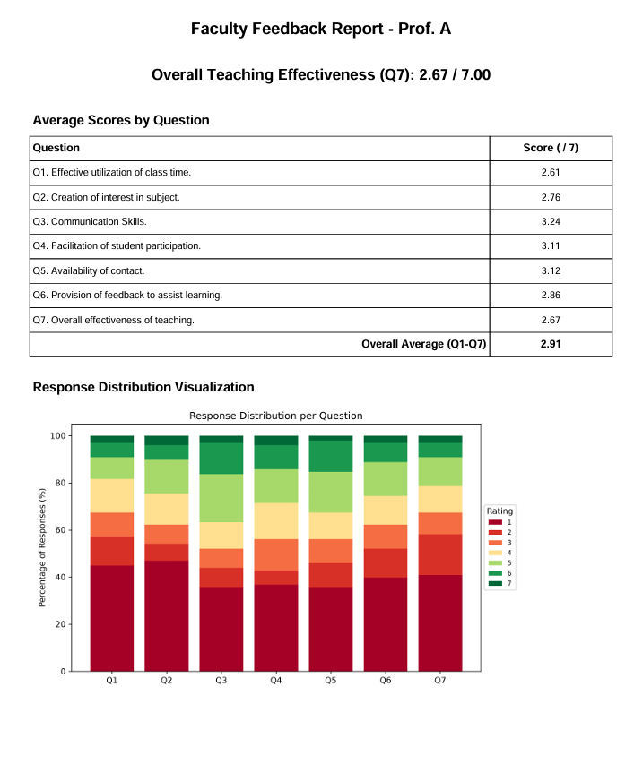
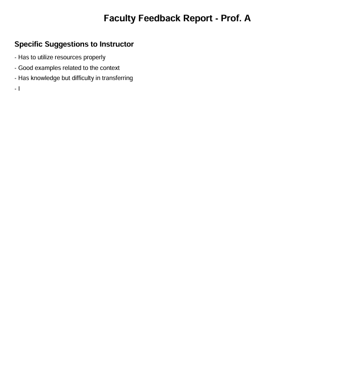

# 📊 Faculty Feedback Report Automation

<div align="center">

### Automated Faculty Evaluation Analysis & PDF Report Generator

Transform raw faculty feedback collected in Excel into professional, institution-ready PDF reports with weighted scoring, response visualizations, and qualitative feedback summaries.

---



</div>

---

## Overview

Faculty feedback is often collected in spreadsheets, making it tedious to manually calculate scores, prepare charts, and generate reports for every instructor.

This project automates the entire workflow by reading the raw Excel feedback file, computing weighted averages for every evaluation criterion, generating response distribution charts, and producing a clean multi-page PDF report within seconds.

The generated report is suitable for academic review, accreditation processes, and faculty performance analysis.

---

# ✨ Features

- Automatic Excel data processing
- Weighted average score calculation
- Overall teaching effectiveness computation
- Response distribution visualization
- Professional PDF report generation
- Faculty name auto-detection
- Support for qualitative student comments
- Institution-ready report formatting

---

# 📥 Input

The application reads structured faculty feedback data directly from Excel.

Input includes:

- Faculty evaluation questions
- Likert-scale responses (1–7)
- Response frequencies
- Student suggestions
- Submission metadata


---

# 📄 Generated Report

The first page provides quantitative analysis including:

- Faculty information
- Overall teaching effectiveness
- Question-wise average scores
- Overall average
- Response distribution charts



---

# 💬 Qualitative Feedback

The second page automatically extracts and formats all written student suggestions into a clean, readable section.



---

# ⚙️ Workflow

```
Excel Feedback
        │
        ▼
Data Extraction
        │
        ▼
Weighted Score Calculation
        │
        ▼
Chart Generation
        │
        ▼
PDF Compilation
        │
        ▼
Professional Faculty Report
```

---

# 📊 Report Contents

Each generated report includes:

- Faculty name
- Overall teaching effectiveness
- Question-wise average scores
- Overall average score
- Response distribution chart
- Student suggestions
- Professional PDF formatting

---

# 🖥 Tech Stack

## Language

- Python

## Libraries

- Pandas
- NumPy
- Matplotlib
- FPDF2
- OpenPyXL

---

# 🚀 Installation

Clone the repository

```bash
git clone https://github.com/yourusername/faculty-feedback-report-automation.git
```

Install dependencies

```bash
pip install pandas numpy matplotlib fpdf2 openpyxl
```

---

# ▶️ Usage

1. Place the faculty feedback Excel file inside the project directory.

2. Update the input file name inside:

```python
EXCEL_FILE = "feedback.xlsx"
```

3. Run the script

```bash
python generate_report.py
```

4. The generated PDF report will be saved automatically in the project directory.

---

# 📂 Project Structure

```text
Faculty-Feedback-Report-Automation
│
├── docs/
│   ├── exceldata.png
│   ├── pdfmainpage.png
│   └── pdfsecondpage.png
│
├── generate_report.py
├── requirements.txt
└── README.md
```

---

# 📈 Automated Calculations

The script automatically computes

- Weighted averages
- Overall faculty score
- Question-wise scores
- Percentage response distribution
- Stacked visualization data

No manual calculations are required.

---

# 🎯 Use Cases

- Universities
- Business Schools
- Engineering Colleges
- Academic Quality Assurance
- Accreditation Documentation
- Faculty Performance Evaluation

---

# Future Improvements

- Batch report generation for multiple faculty
- Department-wise summary reports
- Interactive dashboard
- Excel report export
- Email automation
- Trend analysis across semesters
- Comparison between faculty members

---

# Developed By

**Raghunandan Dasa**

Built to automate the repetitive process of faculty feedback analysis by transforming raw survey data into professional, publication-ready PDF reports with statistical insights and visualizations.

---

# License

This project is licensed under the MIT License.
